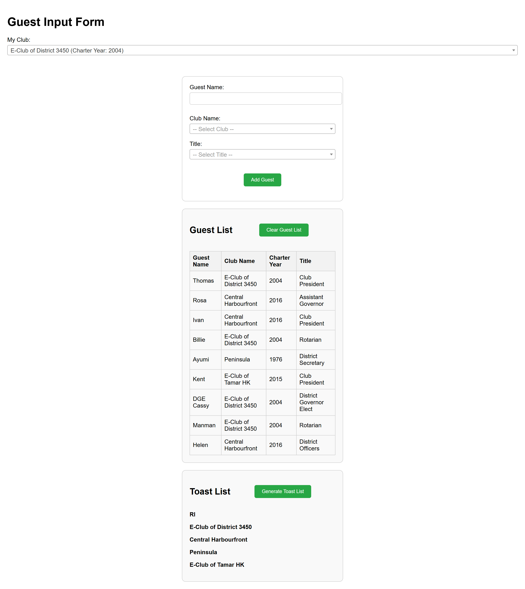

# Rotary Toast List Generator

This is a simple web application for generating toast lists based on given guest list.



## Features

- Add guest information including name, club, and title.
- Generate a toast list based on guest information. The list is sorted by guest title (DG > AG ... etc) and charter year of guest club (from oldest to newest)
- Store guest information in cookies with a 3-day expiry.

## Prerequisites

- Node.js and npm installed on your machine.
- AWS account with access to S3.

## Running Locally

1. **Clone the repository**:

   ```sh
   git clone https://github.com/hknakata/rotary-toast-list-app.git
   cd rotary-toast-list-app
   ```

2. **Install dependencies**:

    ```sh
    npm ci
    ```

3. **Install live-server**：

    ```sh
    npm i -g live-server

4. **Add `start` script by editing package.json**

    ```js
    "start": "live-server",
    ````

5. **Start the development server**:

    ```sh
    npm start
    ```

The application will be available at http://localhost:8080 or http://127.0.0.1:8080

## Deploying to AWS S3

1. Create an S3 Bucket:
 - Log in to the AWS Management Console.
 - Navigate to the S3 service.
 - Click on "Create bucket".
 - Enter a unique bucket name and select a region.
 - Click "Create bucket".

2. Configure the S3 Bucket for Static Website Hosting:
 - Click on the bucket you just created.
 - Go to the "Properties" tab.
 - Scroll down to the "Static website hosting" section.
 - Click "Edit".
 - Select "Enable".
 - For "Index document", enter index.html.
 - For "Error document", you can enter index.html or leave it blank.
 - Click "Save changes".

3. Set Bucket Policy to Make the Bucket Public:
 - Go to the "Permissions" tab of your bucket.
 - Click on "Bucket Policy".
 - Add the following policy to make the bucket public:

    ```js
    {
    "Version": "2012-10-17",
    "Statement": [
        {
            "Sid": "PublicReadGetObject",
            "Effect": "Allow",
            "Principal": "*",
            "Action": "s3:GetObject",
            "Resource": "arn:aws:s3:::YOUR_BUCKET_NAME/*"
        }
    ]
    }
    ```

 - Replace YOUR_BUCKET_NAME with the name of your bucket.
 - Click "Save changes".

 4. Upload the web app files to the S3 bucket:
 - Go to the "Objects" tab of your bucket.
 - Click "Upload".
 - Click "Add files" and select all files in the dist directory.
 - Click "Upload".

 5. Access the web app:
  - After the upload is complete, you can access your web app using the S3 bucket URL.
 - The URL will be in the format: http://YOUR_BUCKET_NAME.s3-website-YOUR_REGION.amazonaws.com.

## License
This project is licensed under the MIT License.